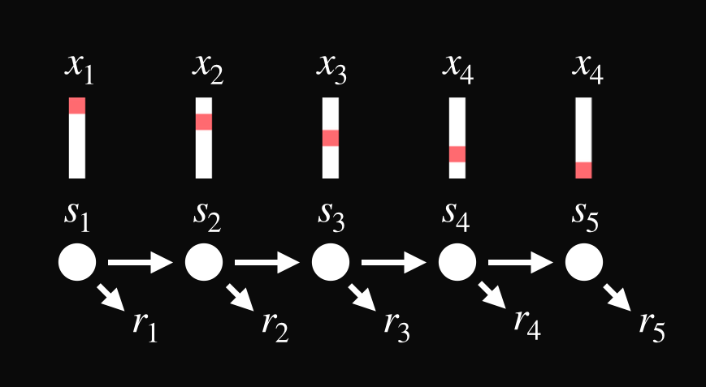
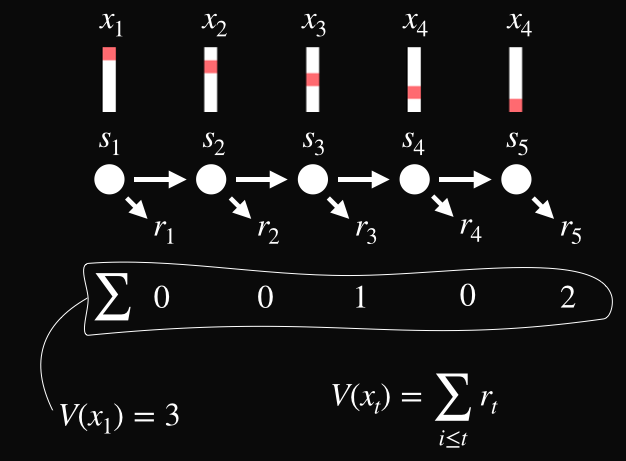
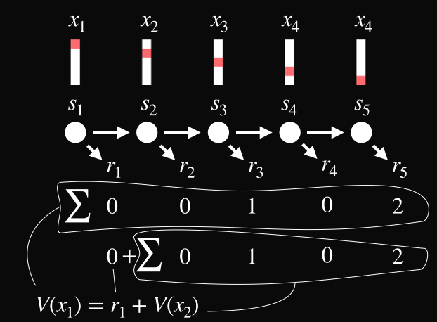
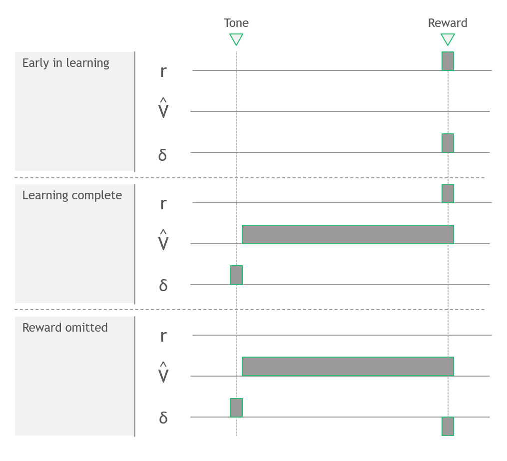

# Reinforcement learning and the brain

Lecture prepared by Moritz Möller

*This script is a collection of the notes I took while I was preparing this lecture on the Neuroscience of reinforcement learning. I provide them as a supplement to the notes students might take themselves. I do not talk about representations in the lecture, because they introduce an additional layer of complexity that does not fit into 45 minutes. However, I believe that it is of central importance to understand the impact of representations, especially in the age of deep RL. Therefore, I include them in these lecture notes. I also do not talk about actions much, focusing on policy evaluation instead, as this is the key theory needed to appreciate the Neuroscience results.*

### Introduction

*In this section: Why should we care about RL, and where is it placed in the scheme of things?*

Why should we care about RL?

- Alpha Go: Humans dominated machines in the game of Go. Not any more. In 2015, a computer defeated the world champion. How did it get so good? [RL](https://www.nature.com/articles/nature16961).
- Brain Prize 2017: the biggest prize in Neuroscience given to three scientists ['For their multidisciplinary analysis of brain mechanisms that link learning to reward'](https://en.wikipedia.org/wiki/The_Brain_Prize). Their theory came from RL.

A map of RL in the grand scheme of things:

- RL in AI/ML/computer science/engineering: origin optimal control, e.g. which inputs should one give a complicated system to achieve a given outcome (Example: balancing a pole on a car. Inputs: moving the car. Objective: keep the stick up). Later taken up as one of the three disciplines of ML (supervised, unsupervised, RL)
- RL in psychology: Animal learning. Rescorla-Wagner model of associative learning. Behaviourism (reinforcement central concept, i.e. [pigeons learn to play ping pong](https://www.youtube.com/watch?v=vGazyH6fQQ4&frags=pl%2Cwn)).
- RL in Neuroscience: Similarity between DA signals and RL signals, discovered in the 90s. Since then, RL became one of the most important theoretical frameworks in neuroscience, inspiring a lot of research.

### The setting of RL

*In this section: what is reinforcement learning? Which concepts does it use?* 

What is RL? A collection of algorithms that ...

- ... mimic learning by doing, i.e. learning through interaction.
- ... enable an agent to learn how to best achieve a given goal.

*Example: Create a program that solves a Rubix cube (i.e. Rubix cube in, step-by-step solution out). This could be solved using RL: Create an agent, allow the agent to try out different things with the Rubix cube, and reward it when it solves it. Given an appropriate learning algorithm and enough time, the agent will eventually learn to solve the cube, and can then tell us the steps that it uses. RL can also be used to train a robot hand to implement a solution--see [here](https://openai.com/research/solving-rubiks-cube)!*

To code this, we must model the situation. In RL, we'll deal with **states** and **representations** of states. The state is the current situation, the representation is some description of that situation. 

*Example: For the Rubix cube, the state is the configuration of the cube. One representation of the state might be pictures of the cube, another might be a table of fields and the colours on them, etc.*

We must also specify the goal. In RL, one uses a **reward signal** that tells the agent how 'good' a state is. 

*Example: For the Rubix cube, we might assign a reward $r=1$ to the solved cube, and $r =0$ to all other states. Alternatively, we may assign $r = -1$ to all states but the solved state (i.e. punish the agent for every state that is not the solution).*

Finally, we must specify how states are connected. For every given state, we must specify to which other states we might go from that one, and with which probabilities. This is called **transitions**. Normally, transitions would require the agent to act.

RL deals with actions as well. Today, we skip them because they make things more complicated. Instead of looking at actions, we focus on something called **policy evaluation** which means: we already have a strategy for selecting actions, and we want to learn by trying out this strategy. Today, we are the passive observers of our actions. Then transitions just occur from state to state.

*Example: In the Rubix cube, we must link configurations that can be turned into each other by making one change to the cube (there are twelve atomic actions on can perform on the cube, so each state can transition into twelve others). These are the possible transitions. As far as transition probabilities are concerned, we might assume for now that all possible transitions are equally likely (i.e. each transition occurs with a probability of 1/12). This corresponds to a random strategy. Now, what could we learn from interaction with the cube (i.e. trying out our random strategy) that would help us achieve our goal of solving the cube quickly?*

What we will focus on today is the **value function**. The idea is that we construct a map that allows us to predict the sum of upcoming rewards. 

*Example: For the cube, a value function could tell us: In this state, your chance of solving the cube is 0.20 per cent (for only rewarding the solution) or it could tell us that this state is on average 10 moves away from the cube (if we use the punishing reward). If we had this function, we could choose which states to go to next, by comparing their value. In our example, having the value function is the same as having a solution.*

It is important to understand that value is not the same as reward. Value is the *expected sum of upcoming rewards*. 

*Example: Imagine a state where the cube is almost solved, i.e. one more move must be performed to solve it. This state will not be rewarded (we only reward the solution). So there is no reward attached to the state, but still, we would think of it as a 'good' state, since it is very close to our goal. The idea of value learning/policy evaluation is to attach value to this state, by experiencing through trial and error that it is close to the goal state.*

**Summary:** Concepts until now...

- States (configuration of the cube)
- Representations of states (some way to communicate the configuration to the agent)
- Reward signal (marks the goals, here reward only a solved cube)
- Transitions between states (which configurations can turn into each other?)
- The value function (expected sum of upcoming rewards, i.e. how well will I do from now on?)

### The TD algorithm for reward prediction

*In this section: How can we construct the value function from experience?* 

We will now look at an algorithm that we can follow to learn the value function through interaction. It is called **temporal difference learning** (TD). Let's see how it works!

Assume the following simple situation:

- We have a couple of states, which we visit one after the other, i.e. a chain. Transitions are deterministic (from each state, we move to a specific next state with probability 1).
- Let $s_t$  be the state that we occupy at step $t$, and $x_t$ it's representation. We'll limit ourselves to representations that are feature vectors, i.e. vectors with entries 0 and 1. Then $(x_t)_i = 1$  means that the feature $i$ was part of the description of the state $s_t$.
- Let $r_t$ be the reward that we obtain for occupying the state $s_t$. We'll get it as we leave the state.

*Figure: States, transitions, rewards.*

Next, we have to specify what we want to learn. We are after the value function, a function that maps a state to the upcoming rewards that we'll obtain after leaving it.

We hence want a map $V$  that takes $x_t$  and gives a prediction of how much reward we'll get from now on: 

$$
V(x_t) = \sum_{i \ge t} r_t
$$

*Figure: The value function.*

Now, we know what we want to do: predict the sum of upcoming rewards. How? Classic statistics approach: we'll fit a model. Here, our model will be 

$$
\hat{V}(x_t) = (x_t)^{T} \omega
$$

where $\omega$ are the parameters that we will optimise through learning. This is a simple linear model, i.e. the representation of the state is linearly mapped onto the value.

Ok, so we know the objective/loss, and we have defined a model. How can we improve our model by interacting? To get there, we need to check how we might improve the model gradually. We choose the simplest way: **gradient descent**. Take the squared error

$$
\mathcal{L} = \left(\hat{V}(x_t) - \sum_{i \ge t} r_t \right)^2
$$

and compute the gradient with respect to our parameters $\omega$:

$$
\nabla_\omega \mathcal{L} = \nabla_\omega\left(\hat{V}(x_t) - \sum_{i \ge t} r_t \right)^2
= 2 \left(\hat{V}(x_t) - \sum_{i \ge t} r_t \right) \nabla_\omega \hat{V}(x_t) 
= 2 \left(\hat{V}(x_t) - \sum_{i \ge t} r_t \right) x_t
=: -2 \delta_t  x_t
$$

where we define $\delta_t = \left(\sum_{i \ge t} r_t  - \hat{V}(x_t) \right)$ as the **reward prediction error**. The gradient tells us how to update our parameters $\omega$ to improve our model:

$$
\omega_i \leftarrow \omega_i + \alpha \delta_t  (x_t)_i
$$

with a learning rate $\alpha$. This update rule affords a nice interpretation:  $\omega_i$ (the parameter associated with the feature $i$  in the representation) will be increased if 1) the upcoming rewards after the current state are larger than expected and 2) the feature $(x_t)_i = 1$, i.e. feature $i$ is part of the current state description. We say that feature $i$ predicts a reward if it appears in a state which is followed by a lot of rewards.

 At the moment, to compute the update, we need:

1. The state $x_t$
2. The predicted sum of upcoming rewards $\hat{V}(x_t)$
3. The actual sum of upcoming rewards, $\sum_{i \ge t} r_t$

The difficult one is the last. How can we get this? The solution is simple but clever: we estimate it with what we already know! Like so:

$$
\sum_{i \ge t} r_t = r_t + r_{t+1} + r_{t+1} + \dots = r_t + \sum_{i \ge t+1} r_t
= r_t + V(x_{t+1}) \approx r_t + \hat{V}(x_{t+1})
$$

Instead of using the actual sum of upcoming rewards, we'll use our best guess of it, which is constructed from the reward that we got from the current state and the reward we expect to get from the next state onwards.

*Figure: Bootstrapping the value target.*

Using this trick, the prediction error becomes

$$
\delta_t = \left(r_t +  \hat{V}(x_{t+1}) - \hat{V}(x_t) \right).
$$

This is called the **temporal difference error**.

With this, our learning algorithm is complete: When transitioning from state $s_t$ to state $s_{t+1}$, we...

1. Take $x_t$, $x_{t+1}$ and $r_t$ (all of those are the signals we are getting currently)
2. Compute $\delta_t = \left(r_t +  \hat{V}(x_{t+1}) - \hat{V}(x_t) \right)$ using our current model of the value function $\hat{V}$
3. Update the parameters $\omega$ via gradient descent: $\omega \leftarrow \omega + \alpha \delta_t  x_t$.

If you repeat this often enough, you are guaranteed to find the optimal parameters! So we did it: we found an algorithm that allows us to learn the value function gradually from experiencing the environment!

### TD, Pavlovian conditioning and dopamine

*In this section: the TD model of Pavlovian conditioning, and the RPE hypothesis of dopamine.*

Enough maths for today! Let's go over to neuroscience! The idea is: we take some experimental situation, apply our model to it and extract the various signals (i.e. reward signal, value signal, prediction error signal etc). Then we can compare them to neural signals like firing rates, BOLD, ...

The experiment we'll look at is a very simple one: Pavlovian conditioning. One trial looks like this: a tone is played, and after a delay (say 5 seconds), a reward (say a drop of juice, this is in the macaque) is given.

What type of behaviour do we expect? Initially, the monkey will lick when the reward is delivered. After training, the monkey will start licking when the tone is played, just like Pavlov's dog starts to salivate from hearing the bell. This tells us that there is some reward prediction (or at least juice prediction) going on: the initially neutral cue is now associated with the juice. This is a good experiment to model with TD since it is about reward prediction!

To set up our model, we'll have to think about states and representations. 

**States**: we'll discretise time. States will be that state of the experiment, as seen by the monkey, at a short given time interval. As time passes, the monkey moves from state to state.

**Representations**: When considering this the first time, one might think that the state could be fully described by whether the tone is heard or not. E.g. $x_t = 1$ when the tone was played in the current trial, and $0$ else. The state is communicated to the agent by saying 'tone' or 'no tone'. This is a perfectly ok representation, but if you try it, you see that it does not work! The monkey must have something more sophisticated going on! Instead, we'll use the stopwatch representation: essentially, when describing a state to the agent we say: 'tone was played 2s ago'. 

So, what do we get?

*Figure: The TD signals during Pavlovian conditioning. Adapted from [2].*

The brain is of course behind the conditioning that we see in animals. Our discipline, Neuroscience, is the study of how the nervous system generates behaviour. Hence, here we ask: how does the brain learn about reward-predicting stimuli? One approach is to take the signal from our model and look for them in the brain. This was done, and they were found in the activity of dopaminergic neurons!

**Refreshing dopamine knowledge** (in mammals, see e.g [1]): DA-producing neurons...

- ... are found in the ventral tegmental area (VTA) and substantia nigra pars compacta (SNc). 
- ... project mainly to the striatum and the frontal cortex. 
- ... broadcast their output to many target sites (500 000 synaptic contacts per DA neuron). 
- ... produce a fairly homogenous signal (but new evidence shows that it is more complicated...)
- ... play a role in reward behaviour (see Olds and Milner's self-stimulation experiments)

So, what does DA activity look like during a task like the one we modelled? Check Figure 1 of [3] (for example [here](http://www.gatsby.ucl.ac.uk/~dayan/papers/sdm97.pdf)) to see the recordings. You will find that dopamine firing resembles exactly one of the above signals--NOT reward (what people thought previously), NOT value, but **reward prediction error**.

This amazing correspondence sparked **the reward prediction error hypothesis of dopamine neuron activity**: 

*One of the functions of the phasic activity of dopamine-producing neurons in mammals is to signal an error between an old and a new estimate of expected future reward to target areas throughout the brain.* 

### Outlook

We ignored actions, but finding the best actions is the main goal of RL. To learn how actions are included, one could look at...

- ... Markov Decision Processes (MDPs): those are the theoretical framework of RL.
- ... policies: maps from states to actions.
- ... action-value functions Q: value for combinations of actions and states. 
- ... Q-learning: one basic algorithm of RL, complete in the sense that it deals with both value learning and policy improvement.

RL is an active field of research with many challenges and unsolved problems!  In the field of neuroscience, actions have been introduced through the actor-critic model: adding an action selection mechanism to our evaluation system above gives an account of an animal that learns how to act to achieve goals. Another very active area in neuroscience and psychology research is the question of model-free versus model-based learning. Above, our agent only learns values. If it would instead learn how states turn into other states, it could plan! 

At the end of the day: the key points of RL are...

- Try and evaluate: try out different things, and reinforce those that were good. 
- Delayed rewards: often, it is not immediately clear whether an action was good or bad. That's a problem of evaluation and the reason we need value learning. Today's value function predicts tomorrow's rewards, and tells us which states to seek out!

### Try it yourself!

To get a gut-level understanding of what the TD algorithm is doing, and how learning commences, try and code up the model described above! You'll need to:

* Go through a sequence of trials.
* Within each trial, go through all time steps.
* For each step, show the agent the representation of the state it just entered, provide a reward if appropriate, compute the TD error, and update the parameters of its value function model.

During this training, monitor the value function. In the end, you should be able to reproduce *Figure: The TD signals during Pavlovian conditioning.* Good luck!

### References

[1] Bear, M. F. (2016). *Neuroscience*. Lippincott Williams & Wilkins.

My go-to neuroscience textbook.

[2] Sutton, R. S. (2018). *Reinforcement Learning*. A Bradford Book. 

The bible of RL.

[3] Schultz, W., Dayan, P., & Montague, P. R. (1997). A Neural Substrate of Prediction and Reward. *Science*, *275*(5306), 1593–1599. Retrieved February 16, 2020, from 10.1126/science.275.5306.1593 

The seminal paper on the reward prediction error hypothesis of dopamine. 

[4] Rescorla, R. A., & Wagner, A. R. (1972). A theory of Pavlovian conditioning: Variations in the effectiveness of reinforcement and nonreinforcement. *Classical conditioning II: Current research and theory*, *2*, 64-99.

The seminal paper on modelling animal learning.